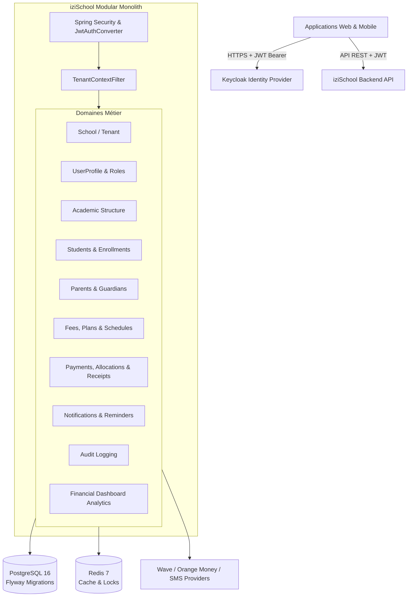

# Architecture Technique — iziSchool Backend MVP

## 1. Vue d'ensemble

**iziSchool** est un SaaS multi-tenant conçu sous la forme d'un **Modular Monolith** (monolithe modulaire) en **Java 21** et **Spring Boot 3.4.x**.

L'application isole strictement les données de chaque école (tenant) au sein d'une base de données PostgreSQL unique tout en maintenant une séparation claire entre les modules métier.



---

## 2. Découpage Modulaire des Packages

Le code source est organisé selon les domaines métier :

```text
com.izischool
├── config                 # Configuration Spring Boot, Sécurité, Cache, OpenAPI, JPA
├── common                 # Entités de base, hiérarchie d'exceptions, gestion d'erreurs
│   ├── entity             # BaseEntity, TenantAwareEntity, SoftDeletableEntity
│   ├── exception          # ApiException, ResourceNotFoundException, etc.
│   ├── response           # ErrorResponse standardisé
│   ├── advice             # GlobalExceptionHandler (@RestControllerAdvice)
│   └── util               # MoneyUtils, ReferenceGenerator
├── tenant                 # Context ThreadLocal, filtres et validation multi-tenant
├── auth                   # UserProfile, rôles applicatifs, CurrentUserContextService
├── school                 # Tenant principal (School), statut, configuration
├── academic               # AcademicYear, GradeLevel, SchoolClass
├── student                # Student, StudentEnrollment, StudentImport
├── parent                 # Parent, StudentParent (relations multiples)
├── finance                # Fee, FeeAssignment, PaymentPlan, PaymentSchedule
├── payment                # Payment, PaymentAllocation, Receipt, PaymentProviders
├── notification           # Notification, NotificationTemplate, ReminderRule, Providers
├── audit                  # AuditLog, AuditAction, AuditService
└── dashboard              # DashboardService, DashboardStatsDto
```

---

## 3. Stratégie Multi-Tenancy

1. **Clé de partitionnement** : Chaque entité métier est liée à une `School` via `TenantAwareEntity` (`school_id`).
2. **Contexte Tenant** : Le `TenantFilter` intercepte les requêtes authentifiées, extrait le `sub` du JWT Keycloak, résout le `UserProfile` local et initialise le `TenantContext` (`ThreadLocal`).
3. **Contrôle d'accès** : Le service `TenantValidationService` valide systématiquement que l'école de l'utilisateur correspond à l'école de la ressource ciblée.
4. **Rôle Super-Admin** : Les utilisateurs possédant `ROLE_SUPER_ADMIN` contournent l'isolation locale pour gérer l'ensemble de la plateforme.

---

## 4. Persistance, Caching et Observabilité

- **PostgreSQL 16** : Source de vérité unique avec contraintes d'intégrité strictes, clés étrangères, index optimisés et contrôle d'accès concurrentiel (`@Version Long version`).
- **Flyway** : Gestion des versions du schéma de base de données (V1 à V7).
- **Redis 7** : Cache applicatif (`school_info`, `notification_templates`, `dashboard_stats`).
- **Spring Boot Actuator** : Métriques et sondes de santé (`/actuator/health`, `/actuator/info`).
- **Springdoc OpenAPI** : Documentation interactive Swagger UI configurée avec sécurité Bearer JWT.
