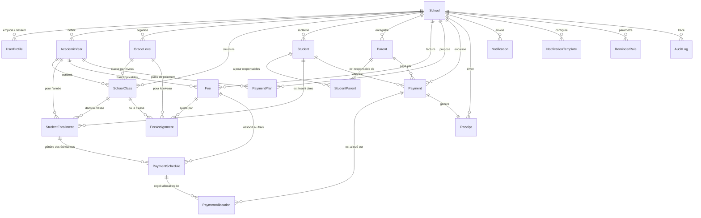

# Modèle de Données Métier — iziSchool

## 1. Diagramme Entité-Relation (Mermaid)

---

## 2. Description des Entités Principales

### A. Tenant & Utilisateurs
- **`School`** : Tenant racine avec identifiant UUID technique et `code` d'école unique (ex: `ECOLE-ST-MICHEL`).
- **`UserProfile`** : Profil utilisateur lié à un `keycloakUserId` externe, avec rôle (`DIRECTOR`, `ADMIN`, `ACCOUNTANT`, `PARENT`, `SUPER_ADMIN`).

### B. Structure Académique
- **`AcademicYear`** : Année scolaire (`name`, `startDate`, `endDate`, `status`). Contrainte : une seule année `ACTIVE` par école.
- **`GradeLevel`** : Niveau d'enseignement configurable par école (`CI`, `CP`, `6EME`, `TERMINALE`).
- **`SchoolClass`** : Classe réelle (`6ème A`) rattachée à une année scolaire et un niveau.

### C. Élèves & Responsables
- **`Student`** : Élève avec `studentNumber` unique par école (ex: `ECOLE-STD-00001`), genre, identité, soft-delete.
- **`Parent`** : Responsable légal / parent (téléphone, WhatsApp, email).
- **`StudentParent`** : Association multiple (père, mère, tuteur, contact financier, contact d'urgence).
- **`StudentEnrollment`** : Inscription annuelle d'un élève dans une classe pour une année scolaire donnée.

### D. Frais & Échéanciers
- **`Fee`** : Frais de base (`REGISTRATION`, `TUITION`, `OTHER`) avec montant par défaut.
- **`FeeAssignment`** : Surcharge de montant spécifique à un niveau ou une classe particulière.
- **`PaymentPlan`** : Modèle d'échéances (ex: 10 mensualités, paiement unique, etc.).
- **`PaymentSchedule`** : Échéance réelle pour un élève (`amountDue`, `amountPaid`, `remainingAmount`, `status`).

### E. Paiements, Allocations & Reçus
- **`Payment`** : Transaction financière avec `paymentReference` unique et `providerTransactionId` pour l'idempotence.
- **`PaymentAllocation`** : Ventilation d'un paiement sur une ou plusieurs échéances.
- **`Receipt`** : Reçu horodaté avec numéro unique par école (`ECOLE-REC-2026-000001`).

### F. Communication & Audit
- **`Notification`** / **`NotificationTemplate`** / **`ReminderRule`** : Gestion des messages multi-canaux (SMS, WhatsApp, Email).
- **`AuditLog`** : Traçabilité immuable des opérations sensibles.
