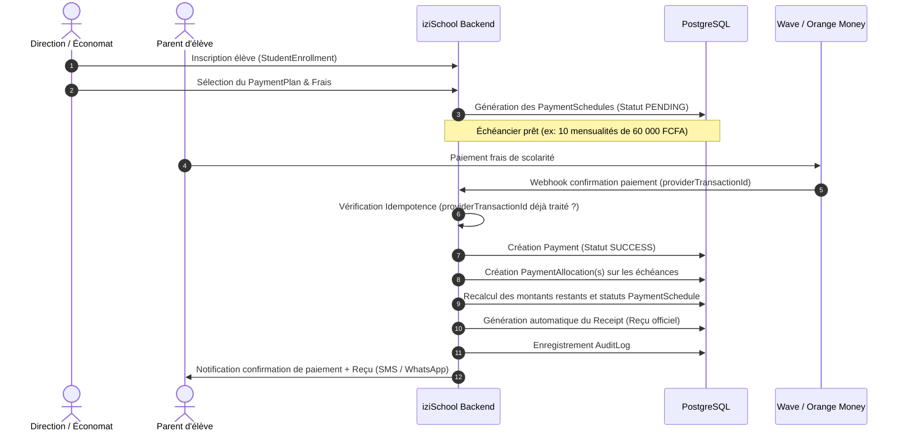

# Workflow Financier & Gestion des Paiements — iziSchool

## 1. Cycle de Vie Financier d'une Inscription



---

## 2. Règles de Recalcul des Échéances (`PaymentSchedule`)

Pour chaque échéance ciblée :

1. **`amountPaid`** = `amountPaid` + `allocatedAmount`
2. **`remainingAmount`** = `amountDue` - `amountPaid`
3. **Transition de statut** :
   - Si `remainingAmount == 0` : `status = PAID`
   - Si `amountPaid > 0` et `remainingAmount > 0` : `status = PARTIALLY_PAID`
   - Si `currentDate > dueDate` et `remainingAmount > 0` : `status = OVERDUE`
   - Sinon : `status = PENDING`

---

## 3. Gestion de l'Idempotence des Paiements

Les webhooks des fournisseurs de paiement (Wave, Orange Money, etc.) peuvent être émis plusieurs fois en cas de latence réseau.

Le modèle iziSchool garantit l'idempotence via :
- Une contrainte unique en base de données sur `(provider, provider_transaction_id)` ;
- Une vérification en amont dans `PaymentService` :
  ```text
  Si providerTransactionId existe déjà et est SUCCESS :
      -> Retourner le paiement existant immédiatement sans nouvelle allocation ni émission de reçu en double.
  ```

---

## 4. Ventilation & Paiements Multi-Échéances

Un paiement peut :
- Payer exactement une échéance ;
- Payer partiellement une échéance ;
- Couvrir plusieurs échéances échues et à venir (ventilation FIFO automatique dans l'ordre chronologique des `dueDate`).
