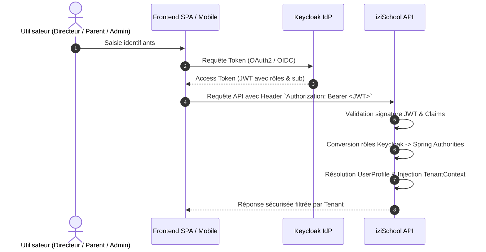

# Sécurité & Multi-Tenancy — iziSchool

## 1. Modèle d'Authentification OAuth2 / Keycloak

iziSchool fonctionne comme un **OAuth2 Resource Server** qui valide les JWT émis par **Keycloak**. Le backend ne stocke aucun mot de passe.

---

## 2. Rôles Applicatifs & Permissions

| Rôle | Portée | Description |
| :--- | :--- | :--- |
| `ROLE_SUPER_ADMIN` | Plateforme SaaS | Administration globale de la plateforme, gestion des écoles et abonnements |
| `ROLE_DIRECTOR` | École (Tenant) | Direction de l'établissement, supervision académique et financière |
| `ROLE_ADMIN` | École (Tenant) | Administration scolaire, gestion des élèves, classes et inscriptions |
| `ROLE_ACCOUNTANT` | École (Tenant) | Économat, encaissement, validation des paiements et relances |
| `ROLE_PARENT` | Famille (Tenant) | Consultation des échéanciers de ses enfants, paiements et reçus |
| `ROLE_TEACHER` | École (Tenant) | (Futur) Gestion pédagogique, notes et présences |
| `ROLE_STUDENT` | École (Tenant) | (Futur) Consultation de son espace scolaire |

---

## 3. Détection et Isolation du Tenant

Le `school_id` n'est **jamais** accepté aveuglément depuis les paramètres de requête de l'utilisateur pour déterminer le tenant courant :

1. Le JWT fournit le `keycloak_user_id` (`sub`).
2. La table locale `user_profiles` associe ce `keycloak_user_id` à une entité `School`.
3. Le `TenantFilter` initialise le `TenantContext` pour le thread de la requête courante.
4. Si un utilisateur tente d'accéder à des données d'un autre tenant, `TenantValidationService` lève une `TenantAccessException` (HTTP 403 Forbidden).
